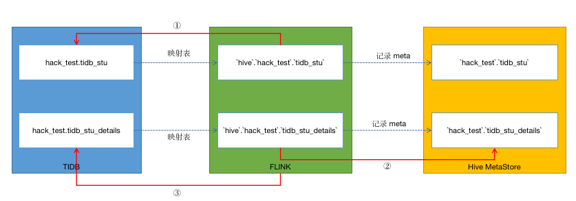
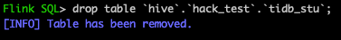
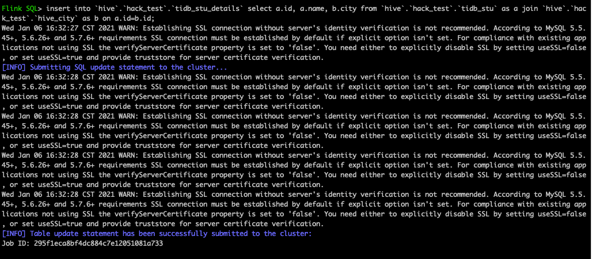

# Batch 实现思路

### 流程图

  

### 原理

##### Flink 表 
&ensp;&ensp;&ensp;&ensp;1.Hive 表  
&ensp;&ensp;&ensp;&ensp;2.TIDB 映射表 

##### JOIN SQL（以 insert into … select … from xxx join xxx 为例） 
&ensp;&ensp;&ensp;&ensp;1.Flink 通过 TiBigData 查询 TIDB 表  
&ensp;&ensp;&ensp;&ensp;2.Flink 直接查询 Hive 表  
&ensp;&ensp;&ensp;&ensp;3.结果做 join，再 insert 到 TIDB 表  
   
# TiBigData
Flink 与 TIDB 交互，可以借助 TiBigData 项目，通过测试 TiBigData， 已有功能基本满足了我们 hack 题目的需求。
 
### 基本功能
##### TIDB 表
1.建表 
CREATE TABLE hack_test.tidb_stu ( 
 `id` int(11) DEFAULT NULL, 
 `name` varchar(255) DEFAULT NULL 
) ENGINE=InnoDB DEFAULT CHARSET=utf8mb4 COLLATE=utf8mb4_bin; 
 
2.插入数据 
insert into tidb_stu values(1, 'zhangsan');
 
insert into tidb_stu values(2, 'lisi');
   
##### Flink 映射表

1.建库 
create database `hive`.`hack_test`;
 
 

 

2.删库 
drop database `hive`.`hack_test`;
 
 

 

3.建映射表（properties 里制定了 TIDB 表相关的配置） 
CREATE TABLE `hive`.`hack_test`.`tidb_stu`(
 
id int,
 
name string
 
) WITH (
 
  'connector' = 'tidb',
 
  'tidb.database.url' = 'jdbc:mysql://${ip}:${port}/flink',
 
  'tidb.username' = '${user}',
 
  'tidb.password' = '${pwd}',
 
  'tidb.database.name' = 'hack_test',
 
  'tidb.maximum.pool.size' = '10',
 
  'tidb.minimum.idle.size' = '0',
 
  'tidb.table.name' = 'tidb_stu',
 
  'tidb.write_mode' = 'upsert',
 
  'sink.buffer-flush.max-rows' = '0'
 
 );
 
 

 

4.删除 TIDB 映射表（TIDB 数据库里的表不受影响） 
drop table  `hive`.`hack_test`.`tidb_stu`
 
 

 

5.查询 TIDB 映射表（最终查询的是 TIDB 数据库里的表) 
select * from `hive`.`hack_test`.`tidb_stu`;
 
 
   
##### Hive 表

1.建表 和 准备数据 
create table hive_city(id int, city string) row format delimited fields terminated by ',' stored as TEXTFILE;

2.查询 HIVE 表 
select * from `hive`.`hack_test`.`hive_city`;
 
 
   
##### 联合查询

1.测试 join TIDB 表 和 Hive 表 
select a.id, a.name, b.city from `hive`.`hack_test`.`tidb_stu` as a join `hive`.`hack_test`.`hive_city` as b on a.id=b.id;
 
 

 

2.测试 join 后的结果 insert 到 TIDB 
 1）创建 TIDB 表 
CREATE TABLE hack_test.tidb_stu_details (`id` int(11) DEFAULT NULL, `name` varchar(255) DEFAULT NULL, `city` varchar(255) DEFAULT NULL) ENGINE=Inno
  
 2）创建 Flink 映射表 
CREATE TABLE `hive`.`hack_test`.`tidb_stu_details`(
 
id int,
 
name string,
 
city string
 
) WITH (
 
  'connector' = 'tidb',
 
  'tidb.database.url' = 'jdbc:mysql://${ip}:${port}/flink',
 
  'tidb.username' = '${user}',
 
  'tidb.password' = '${pwd}',
 
  'tidb.database.name' = 'hack_test',
 
  'tidb.maximum.pool.size' = '10',
 
  'tidb.minimum.idle.size' = '0',
 
  'tidb.table.name' = 'tidb_stu_details',
 
  'tidb.write_mode' = 'upsert',
 
  'sink.buffer-flush.max-rows' = '0'
 
 );
  
 3）join 结果插入 TIDB 
insert into `hive`.`hack_test`.`tidb_stu_details` select a.id, a.name, b.city from `hive`.`hack_test`.`tidb_stu` as a join `hive`.`hack_test`.`hive_city` as b on a.id=b.id;
 
 
  
 4）TIDB 端验证插入结果 
 
