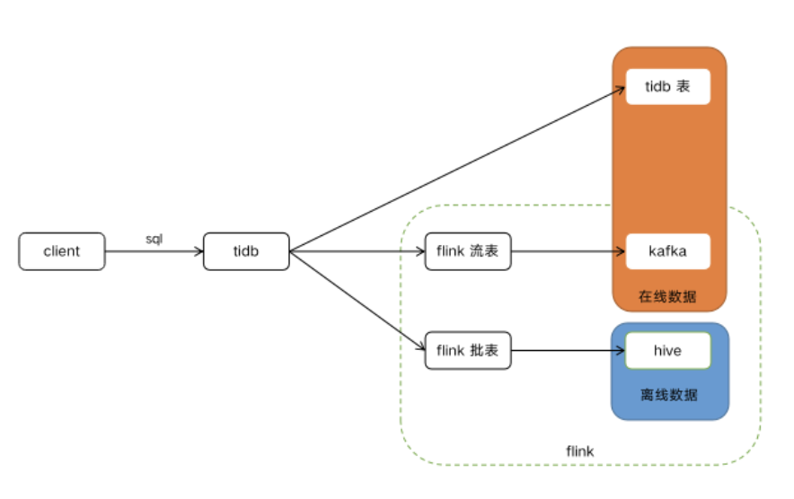
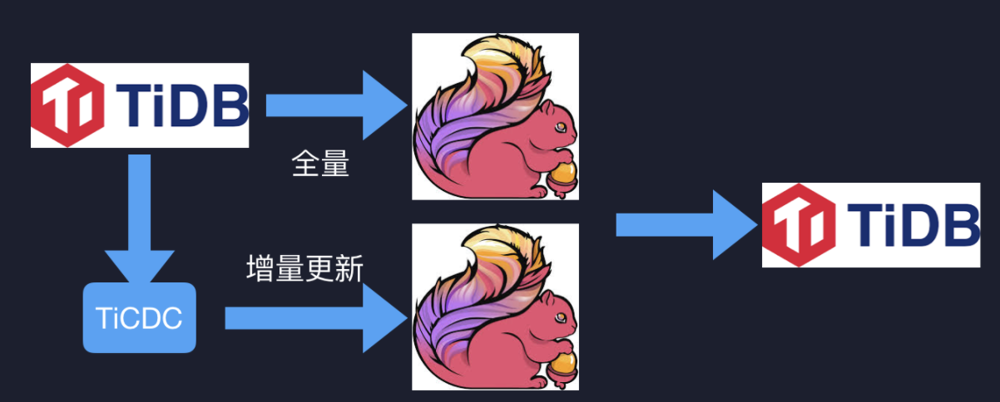

# Proposal: 基于 Flink 的 TiDB 联邦查询

- Author(s):    [顾亮亮](https://github.com/marsishandsome/), [刘卓珉](https://github.com/lzmhhh123), [刘晓龙](https://github.com/Coderlxl), [刘子雄](https://github.com/liuzix/)
- Last updated:  2020-01.06
- Discussion at: <!-- https://github.com/pingcap/tidb/issues/XXX -->

## Abstract

本 issue 旨在解决在线、离线数据查询以及流式计算统一 SQL 入口的问题。需要在 tidb 现有在线数据 SQL 入口的基础上，增加
- 离线数据查询 SQL 入口
- 流式计算 SQL 入口

本 issue 希望能通过 TiDB 和 Flink，利用 TiDB 在线数据上的优势，以及 Flink 在离线数据和流式计算上的优势，打造一个统一的 SQL 入口。用户不需要再意识到我是在用 TiDB、Flink、Spark 或是其他计算引擎，只需要在同一个入口，用同一个语法的 SQL 就能解决在线、离线数据查询，流式计算等问题。

## Background

对于在线数据，TiDB 目前是在线数据的入口。

对于离线数据，大部分公司都提供了 Hive，Presto，Spark 等多套查询引擎。对于流式计算，大部分公司提供了 Flink、Spark Streaming 等引擎。存在的一些缺点：
- 对用户来说，没有统一的入口
- SQL 语法也存在一些差异
- 针对在线数据的分析，需要通过 datasync 将在线数据同步到 hive，再进行分析，实时性低，链路长，且数据存在冗余

目标：以 TiDB 作为在线、离线数据查询以及流式计算的统一 SQL 入口。

## Proposal

首先来看下架构图



TiDB 需要支持 flink 外表(批表 + 流表)，例如通过下面的语法来创建

```
create external xxx … location ‘hdfs://xxxxx’;
CREATE EXTERNAL XXX engine = +://xxx.xxx.xxx.xxx:1234’;
```

外表的接口会被抽象出来，除了可以实现 flink 外，可以接入任意实现了对应接口的外部 SQL 引擎，例如 spark 等。

当 tidb 收到某个 sql 请求需要访问外部数据时，tidb 会把请求下推到 flink 来执行，flink 执行完再将结果返回给 tidb。

当某个 sql 需要同时访问 tidb 的表和外部时，tidb 同样会将该请求下推到 flink 执行，在 [TiBigData](https://github.com/tidb-incubator/TiBigData) 项目中已经实现了 flink 从 TiKV 中直接读取 tidb 的数据，因此 flink 有能力来做 tidb 表和外部的关联查询。

详细的设计思路可以参考[Batch 实现思路](./Batch 实现思路.md)。

此外利用上述功能，我们可以让 TiDB 拥有物化视图的能力，架构图如下。



当用户通过 tidb 创建一个物化视图后，首先利用flink来做一次全量数据的计算，并把数据写回到 tidb，然后再启动一个 flink streaming 任务，在处理增量数据，并且把数据更新到 tidb。

详细的设计思路可以参考[物化视图实现思路](./物化视图实现思路.md)。

## Rationale

<!--
A discussion of alternate approaches and the trade-offs, advantages, and disadvantages of the specified approach:
- How other systems solve the same issue?
- What other designs have been considered and what are their disadvantages?
- What is the advantage of this design compared with other designs?
- What is the disadvantage of this design?
- What is the impact of not doing this?
-->

## Compatibility and Migration Plan

<!--
A discussion of the change with regard to the compatibility issues:
- Does this proposal make TiDB not compatible with the old versions?
- Does this proposal make TiDB not compatible with TiDB tools?
    + [BR](https://github.com/pingcap/br)
    + [DM](https://github.com/pingcap/dm)
    + [Dumpling](https://github.com/pingcap/dumpling)
    + [TiCDC](https://github.com/pingcap/ticdc)
    + [TiDB Binlog](https://github.com/pingcap/tidb-binlog)
    + [TiDB Lightning](https://github.com/pingcap/tidb-lightning)
- If the existing behavior will be changed, how will we phase out the older behavior?
- Does this proposal make TiDB more compatible with MySQL?
- What is the impact(if any) on the data migration:
    + from MySQL to TiDB
    + from TiDB to MySQL
    + from old TiDB cluster to new TiDB cluster
-->

## Implementation

<!--
A detailed description for each step in the implementation:
- Does any former steps block this step?
- Who will do it?
- When to do it?
- How long it takes to accomplish it?
-->

## Testing Plan

<!--
A brief description on how the implementation will be tested. Both integration test and unit test should consider the following things:
- How to ensure that the implementation works as expected?
- How will we know nothing broke?
-->

## Open issues (if applicable)

<!--
A discussion of issues relating to this proposal for which the author does not know the solution. This section may be omitted if there are none.
-->
